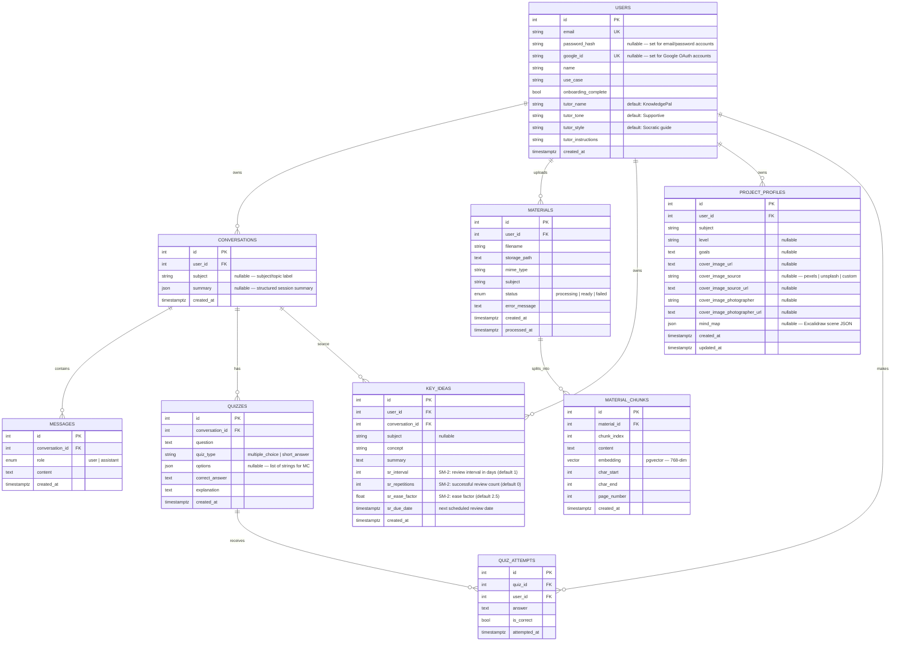

# Database Schema

The application uses **PostgreSQL** with **pgvector** for embeddings and **SQLAlchemy 2.0** async ORM. Migrations are managed by **Alembic**.

## Tables

| Table | Description |
|-------|-------------|
| `users` | Account records — email/password or Google OAuth |
| `conversations` | A single study session owned by a user |
| `messages` | Individual turns within a conversation |
| `materials` | Uploaded study files (PDF, TXT, MD) |
| `material_chunks` | Semantic chunks of materials with pgvector embeddings |
| `quizzes` | Quiz questions generated by the tutor during sessions |
| `quiz_attempts` | Student responses to individual quiz questions |
| `key_ideas` | Saved concepts from sessions, also used as flashcards |
| `project_profiles` | Per-user subject metadata and mind-map storage |

## ER Diagram



## Table Details

### `users`
Account record. Supports both email/password and Google OAuth — `password_hash` and `google_id` are both nullable so either or both can be set.

Tutor customization columns (`tutor_name`, `tutor_tone`, `tutor_style`, `tutor_instructions`) are used in the system prompt for every chat turn. Defaults produce the base "KnowledgePal / Supportive / Socratic guide" persona.

### `conversations`
A study session. `subject` is a free-text label (e.g. "Linear Algebra") inherited from the project context. `summary` is a JSON object populated after a session ends:

```json
{
  "covered":        ["topic A", "topic B"],
  "struggled_with": ["concept C"],
  "key_concepts":   ["A is defined as..."],
  "next_review":    ["topic D"]
}
```

`struggled_with` values are harvested by the weak-area quiz feature.

### `messages`
Each turn in a conversation. `role` is the `message_role` enum: `user` or `assistant`. Full history is loaded for RAG context and for summary generation.

### `materials`
Uploaded study files. `status` progresses through `processing → ready | failed`. The `subject` column associates a file with a project for scoped RAG retrieval.

### `material_chunks`
Semantic retrieval units. Each chunk stores:
- `content`: raw text used in prompts
- `embedding`: 768-dim `pgvector` vector for cosine-similarity search
- `page_number`: for PDF citations in the Sources panel
- `char_start` / `char_end`: byte offsets within the extracted block

### `quizzes`
A quiz question generated by the tutor tool `generate_quiz`. `options` is a JSON array of strings for multiple-choice; `null` for short-answer. Each quiz belongs to exactly one conversation (including practice conversations created for weak-area quizzes).

### `quiz_attempts`
Records one student answer to one quiz. `is_correct` is computed server-side by comparing `answer` to `correct_answer` (case-insensitive). The `user_id` FK enables per-user filtering so users can't see each other's attempts.

### `key_ideas`
Dual-purpose: saved notes from sessions **and** spaced-repetition flashcards. The SM-2 algorithm fields:

| Field | Default | Meaning |
|-------|---------|---------|
| `sr_interval` | 1 | Next review in N days |
| `sr_repetitions` | 0 | Count of successful reviews |
| `sr_ease_factor` | 2.5 | Multiplier — rises with consistent recall, falls with failure |
| `sr_due_date` | `now()` | Timestamp when card is due |

A quality rating of 0–2 resets the card to day 1. A rating of 3–5 advances the interval.

### `project_profiles`
One row per (user, subject) pair — enforced by unique constraint `uq_project_profile_user_subject`. Stores the project cover image (with Pexels attribution fields) and the `mind_map` Excalidraw scene JSON.

## Migration History

| File | Change |
|------|--------|
| `20250225_000001_initial_schema` | `users`, `conversations`, `messages` |
| `20260420_000002_add_material_rag_schema` | `materials`, `material_chunks`, pgvector extension |
| `20260422_000003_add_user_password_hash` | `users.password_hash` |
| `20260422_000004_add_conversation_subject_topic` | `conversations.subject` |
| `20260422_000005_drop_conversation_topic` | dropped redundant `topic` column |
| `20260422_000006_add_quiz_tables` | `quizzes`, `quiz_attempts` |
| `20260422_000007_add_project_profiles` | `project_profiles` |
| `20260422_000008_add_google_auth_onboarding_fields` | `users.google_id`, `users.name`, `users.use_case`, `users.onboarding_complete` |
| `20260423_000009_add_tutor_customization_fields` | `users.tutor_name/tone/style/instructions` |
| `20260423_000010_add_session_artifacts` | `key_ideas`, `conversations.summary` |
| `20260502_000011_add_project_profile_cover_image` | `project_profiles.cover_image_url` |
| `20260502_000012_add_flashcard_sr_fields` | `key_ideas` SR fields (`sr_interval`, `sr_repetitions`, `sr_ease_factor`, `sr_due_date`) |
| `20260502_000013_add_project_cover_image_attribution` | `project_profiles` photographer attribution columns |
