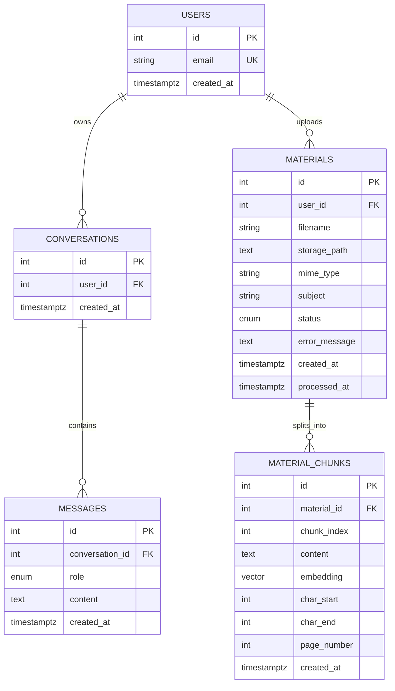

# Database Schema

This project now has five application tables:

- `users`
- `conversations`
- `messages`
- `materials`
- `material_chunks`

The base schema is created by [20250225_000001_initial_schema.py](/Users/jennaitani/Downloads/Intelligent%20Tutoring%20System/alembic/versions/20250225_000001_initial_schema.py), and the RAG tables are added by [20260420_000002_add_material_rag_schema.py](/Users/jennaitani/Downloads/Intelligent%20Tutoring%20System/alembic/versions/20260420_000002_add_material_rag_schema.py).

## ER Diagram

## Table Details

### `users`
Stores the account record used to own conversations and uploaded materials.

Columns:
- `id`: primary key
- `email`: unique user email, indexed
- `created_at`: timestamp with time zone, defaults to `now()`

### `conversations`
Represents a chat session owned by a single user.

Columns:
- `id`: primary key
- `user_id`: foreign key to `users.id`
- `created_at`: timestamp with time zone, defaults to `now()`

### `messages`
Stores each turn in a conversation.

Columns:
- `id`: primary key
- `conversation_id`: foreign key to `conversations.id`
- `role`: enum `message_role`
- `content`: text body of the message
- `created_at`: timestamp with time zone, defaults to `now()`

### `materials`
Stores uploaded study materials and ingestion state.

Columns:
- `id`: primary key
- `user_id`: foreign key to `users.id`
- `filename`: original file name used for display
- `storage_path`: local path to the stored upload
- `mime_type`: uploaded MIME type
- `subject`: optional subject tag from the UI
- `status`: enum `material_status` with `processing`, `ready`, `failed`
- `error_message`: short ingestion failure detail when status is `failed`
- `created_at`: upload timestamp
- `processed_at`: ingestion completion or failure timestamp

### `material_chunks`
Stores semantic-retrieval chunks for a material.

Columns:
- `id`: primary key
- `material_id`: foreign key to `materials.id`
- `chunk_index`: stable order within the material
- `content`: chunk text used for retrieval and prompt context
- `embedding`: `pgvector` embedding column
- `char_start`: chunk start offset inside the extracted block
- `char_end`: chunk end offset inside the extracted block
- `page_number`: optional PDF page number for citations
- `created_at`: insert timestamp

## Relationship Summary

- One `user` can have many `conversations`.
- One `user` can have many `materials`.
- One `conversation` belongs to exactly one `user`.
- One `conversation` can have many `messages`.
- One `material` belongs to exactly one `user`.
- One `material` can have many `material_chunks`.

## Current Limits

This schema still does not model:

- authentication credentials or sessions
- subjects or courses as first-class entities
- learner profiles or mastery tracking
- tool calls, tool outputs, or agent traces
- cloud object storage metadata
- document annotations or citation anchors
