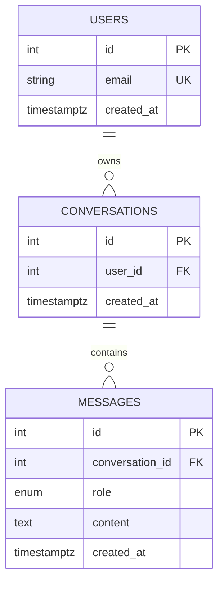

# Database Schema

This project currently has three application tables:

- `users`
- `conversations`
- `messages`

The schema is created by the initial Alembic migration in [20250225_000001_initial_schema.py](/Users/jennaitani/Downloads/Intelligent%20Tutoring%20System/alembic/versions/20250225_000001_initial_schema.py) and mirrored by the SQLAlchemy models in [user.py](/Users/jennaitani/Downloads/Intelligent%20Tutoring%20System/app/models/user.py), [conversation.py](/Users/jennaitani/Downloads/Intelligent%20Tutoring%20System/app/models/conversation.py), and [message.py](/Users/jennaitani/Downloads/Intelligent%20Tutoring%20System/app/models/message.py).

## ER Diagram

## Table Details

### `users`

Purpose:
Stores the account record used to own conversations. The current app uses `X-User-Id` rather than full auth, so this table is the owner anchor for all conversation data.

Columns:

- `id`: primary key
- `email`: unique user email, indexed
- `created_at`: timestamp with time zone, defaults to `now()`

Indexes and constraints:

- primary key on `id`
- unique index on `email`

### `conversations`

Purpose:
Represents a chat session owned by a single user.

Columns:

- `id`: primary key
- `user_id`: foreign key to `users.id`
- `created_at`: timestamp with time zone, defaults to `now()`

Indexes and constraints:

- primary key on `id`
- index on `user_id`
- foreign key `user_id -> users.id`
- `ON DELETE CASCADE` from user to conversations

### `messages`

Purpose:
Stores each turn in a conversation, including both user and assistant messages.

Columns:

- `id`: primary key
- `conversation_id`: foreign key to `conversations.id`
- `role`: enum `message_role`
- `content`: text body of the message
- `created_at`: timestamp with time zone, defaults to `now()`

Enum values:

- `user`
- `assistant`
- `system`

Indexes and constraints:

- primary key on `id`
- index on `conversation_id`
- index on `created_at`
- foreign key `conversation_id -> conversations.id`
- `ON DELETE CASCADE` from conversation to messages

## Relationship Summary

- One `user` can have many `conversations`.
- One `conversation` belongs to exactly one `user`.
- One `conversation` can have many `messages`.
- One `message` belongs to exactly one `conversation`.

## Current Limits

This schema is still Milestone 1 level. It does not yet model:

- authentication credentials or sessions
- subjects or courses
- tutoring goals or learner profiles
- retrieval documents or embeddings
- tool calls, tool outputs, or agent traces
- grading, mastery tracking, or progress analytics

Those would likely arrive in future migrations once the tutoring-specific domain model is introduced.
